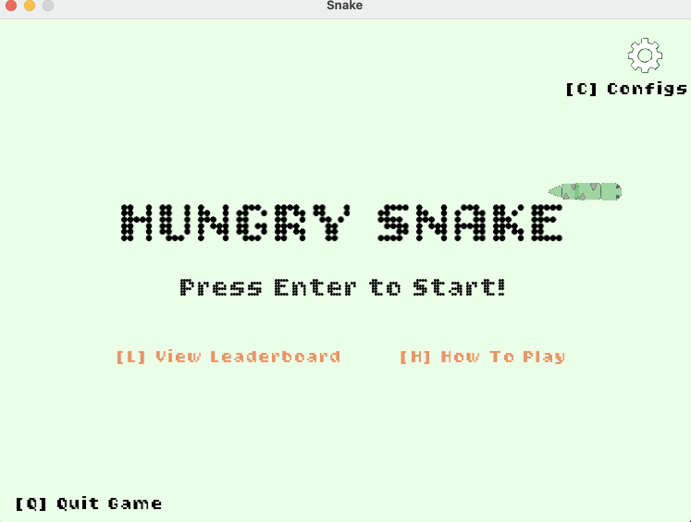
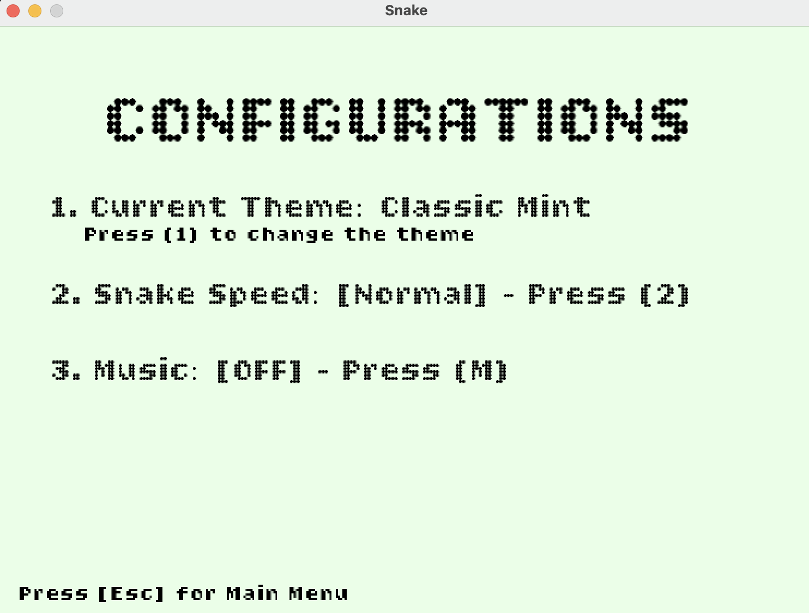

# Hungry Snake

A retro-style arcade game built with C# and the MonoGame framework. Navigate the snake, eat apples, and try to achieve the highest score without crashing into the walls or yourself!

## Screenshots

<table>
  <tr>
    <td><b>Main Menu</b></td>
    <td><b>Configurations</b></td>
  </tr>
  <tr>
    <td></td>
    <td></td>
  </tr>
</table>

## Demo

<div align="left">
  <td></td>
</div>

## Prerequisites

To run this game, you must have the **.NET SDK** installed on your computer.

### How to Install .NET

If you do not have .NET installed, follow these steps:

1. Visit the [official .NET download page](https://dotnet.microsoft.com/download).
2. Download the **.NET SDK** (recommended version 6.0 or later) for your operating system (Windows, macOS, or Linux).
3. Run the installer and follow the on-screen instructions.
4. Verify the installation by opening your terminal/command prompt and typing:
   ```
   bash
   dotnet --version
   ```

### How to Run the Game

1. Open your Terminal or Command Prompt
2. Navigate to the project folder. You must be in the Snake.DesktopGL directory to launch the game:

   ```
   cd Snake/Snake.DesktopGL
   dotnet run
   ```

## Controls & Gameplay

### Movement

Arrow Keys or WASD: Move the snake.

P: Pause/Resume the game.

### Menu Navigation

Enter: Start the game from the Main Menu.

C: Open Configurations/Settings.

L: View the Leaderboard.

H: View "How to Play" instructions.

Esc: Return to the Main Menu or go back.

Q: Quit the game.

### Game Features

Themes: Change the visual style in the Configurations menu (e.g., Classic Mint, Retro Arcade, Wasteland, Lava Pit).

Speed: Adjust the game difficulty by toggling between Slow, Normal, and Fast speeds.

Music: Enable background music and cycle through different tracks (Retro, Hype, or Chill).

Leaderboard: Save your high scores with a custom nickname and see how you rank against previous runs.

## Assets & Credits

The game uses custom sprites and royalty-free music.

### Music Credits:

Retro Game Arcade by moodmode (via Pixabay)

Bounce It by Next Route (via Audio Library)

Pixel Duck by Jhony Grimes (via Audio Library)
