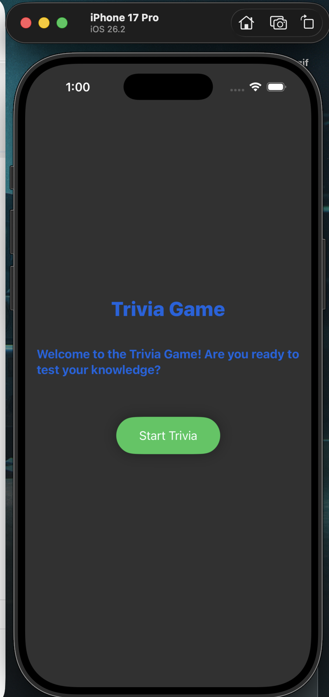

# Trivia Game Demo (Swift)

An iOS trivia game developed using Swift. Allows multiple-choice questions with score tracking and a simple user interface.

## Preview
<table>
  <tr>
    <td><b>Start Up</b></td>
    <td><b>Demo</b></td>
  </tr>
  <tr>
    <td></td>
    <td></td>
  </tr>
</table>

#### Features
- Multiple-choice trivia questions
- Score tracking for correct answers
- Clean UI using SwiftUI

#### How to Run
- Open the project in **Xcode**.
- Run the project on a simulator.

#### Status
- Functional core gameplay implemented; additional UI enhancements planned.
- **Note:** Despite the code being functional, its not completed yet, therefore some code might look odd or too little written, but it does work as a demo
